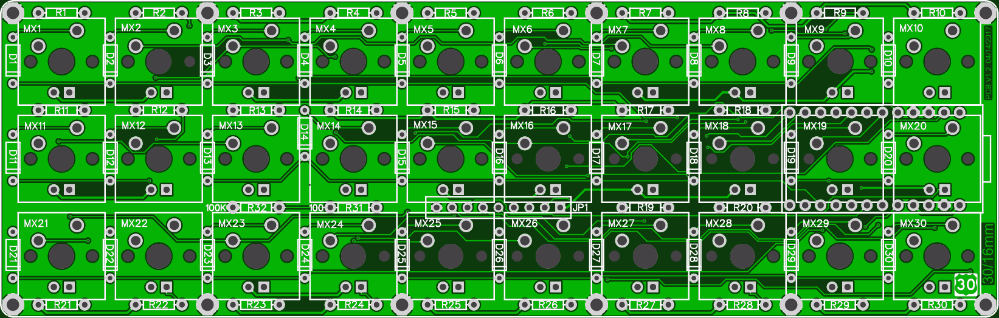
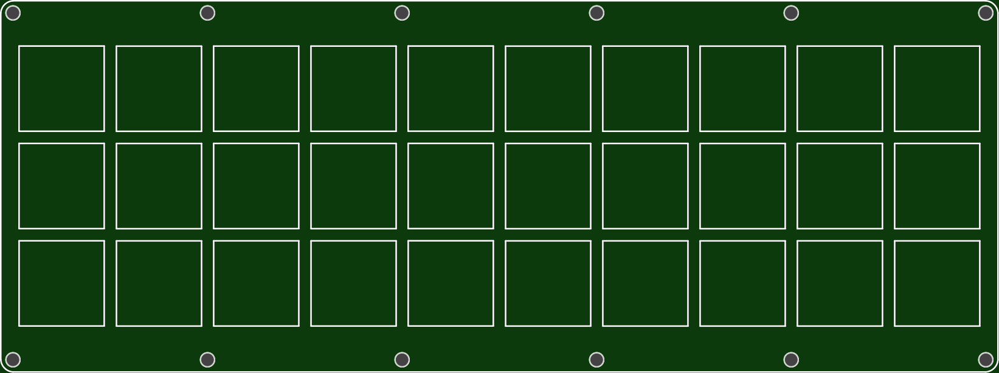

More info here:

http://www.40percent.club/2017/05/16mm-pcb-plates.html

[How to order PCBs from gerber files](http://www.40percent.club/2017/03/ordering-pcb.html)

EasyEDA ordering info:

PCB

Gerber: 30 16mm.zip

    164mm Max* 52mm Max;
    Layers: 2;
    PCB Thickness: 1.6mm;
    PCB Qty.: 5;
    PCB Color: Green;
    Surface Finish: HASL;
    Copper Weight: 1;
    Panelized PCBs: 1

Top

Gerber: 30 16mm top.zip

    164mm Max* 61mm Max;
    Layers: 2;
    PCB Thickness: 1.6mm;
    PCB Qty.: 5;
    PCB Color: Green;
    Surface Finish: HASL;
    Copper Weight: 1;
    Panelized PCBs: 1

Bottom

Gerber: 30 16mm bot.zip

    164mm Max* 61mm Max;
    Layers: 2;
    PCB Thickness: 1.6mm;
    PCB Qty.: 5;
    PCB Color: Green;
    Surface Finish: HASL;
    Copper Weight: 1;
    Panelized PCBs: 1

Gerber files released under https://creativecommons.org/licenses/by-nc-sa/4.0/

