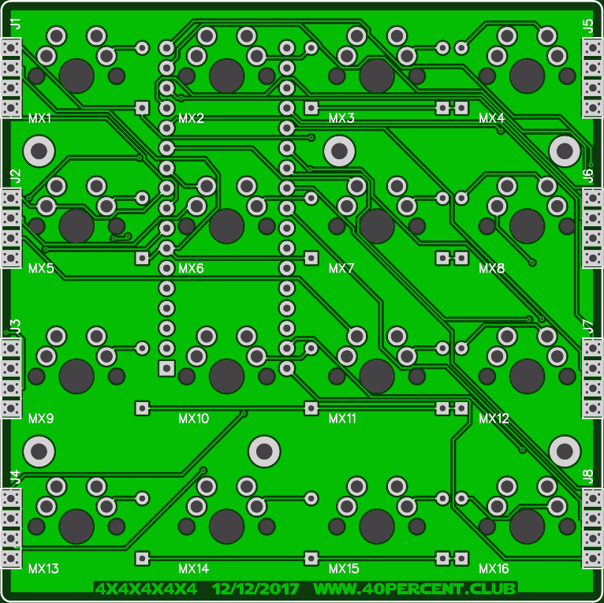
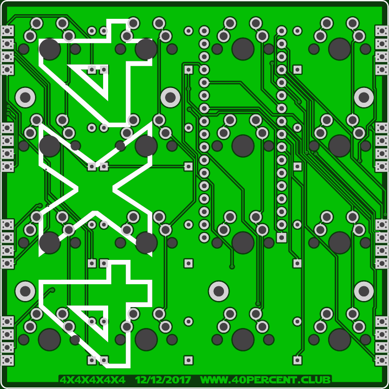

More info here:

http://www.40percent.club/2018/01/4x4x4x4x4.html

[How to order PCBs from gerber files](http://www.40percent.club/2017/03/ordering-pcb.html)

EasyEDA ordering info:

PCB

Gerber: 4x4.zip

    76.2mm * 76.2mm
    Layers: 2
    PCB Thickness: 1.6mm
    PCB Quantity: 10
    PCB Color: Green
    Surface Finish: HASL(with lead)
    Copper Weight: 1oz.

Files released under https://creativecommons.org/licenses/by-nc-sa/4.0/

