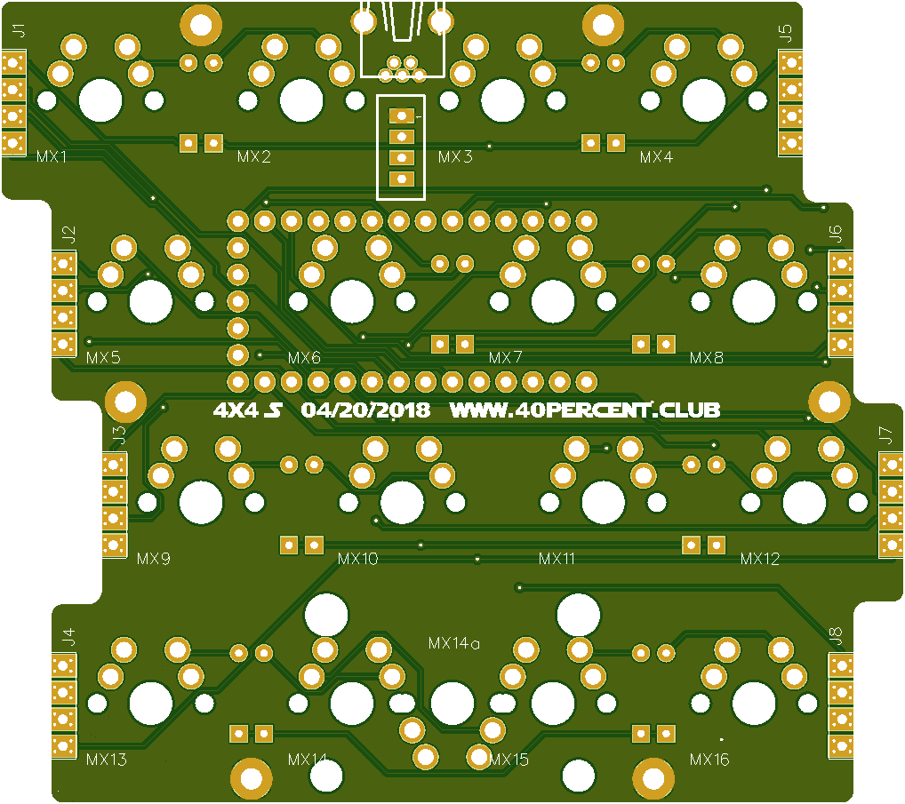
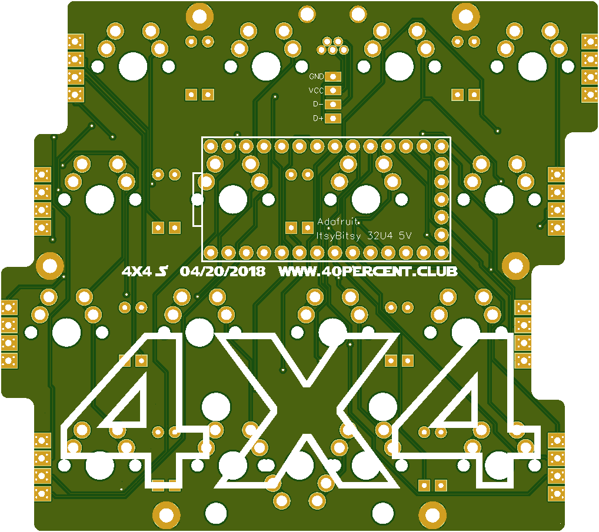

More info here:

https://www.40percent.club/2019/03/4x4-itsybitsy.html

[How to order PCBs from gerber files](http://www.40percent.club/2017/03/ordering-pcb.html)

EasyEDA ordering info:

PCB

Gerber: 4x4S.rar

    Dimension:86mm*76mm
    PCB Qty:10
    PCB Thickness:1.6
    PCB Color:Green
    Surface Finish:HASL(with lead)
    Copper Weight:1 oz

	
	
Files released under https://creativecommons.org/licenses/by-nc-sa/4.0/

