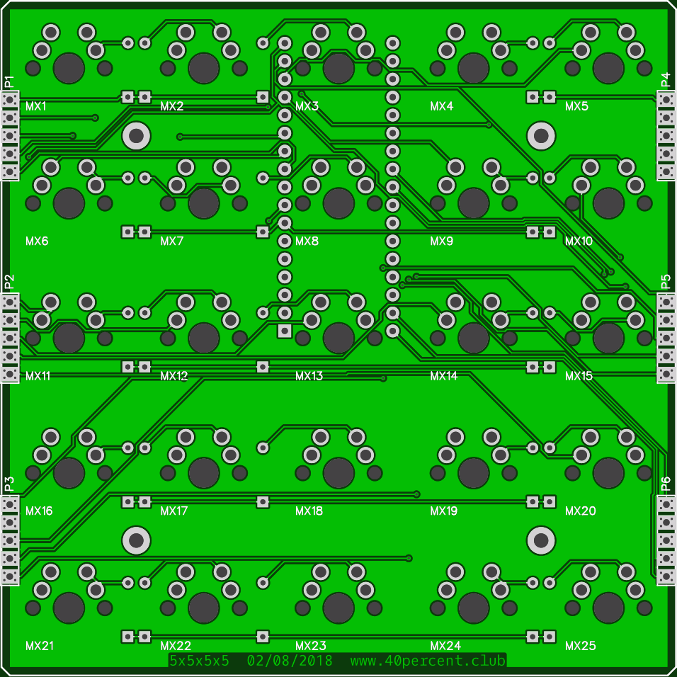
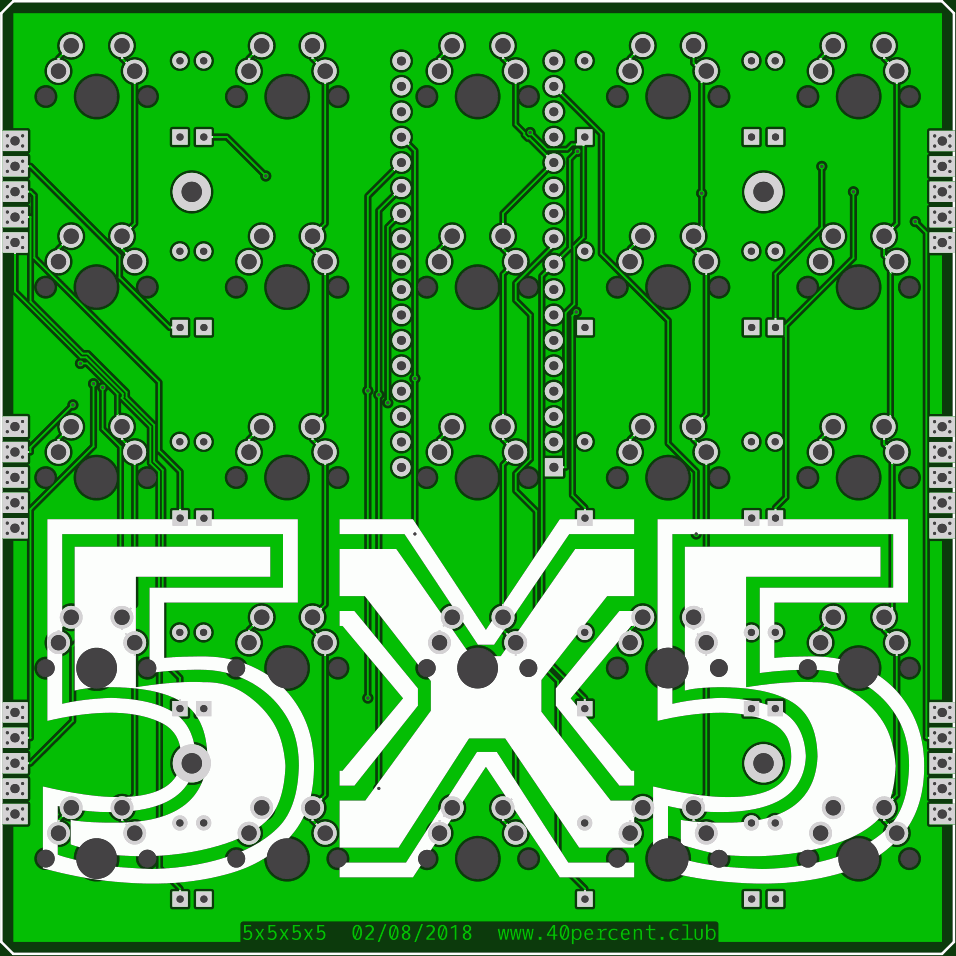
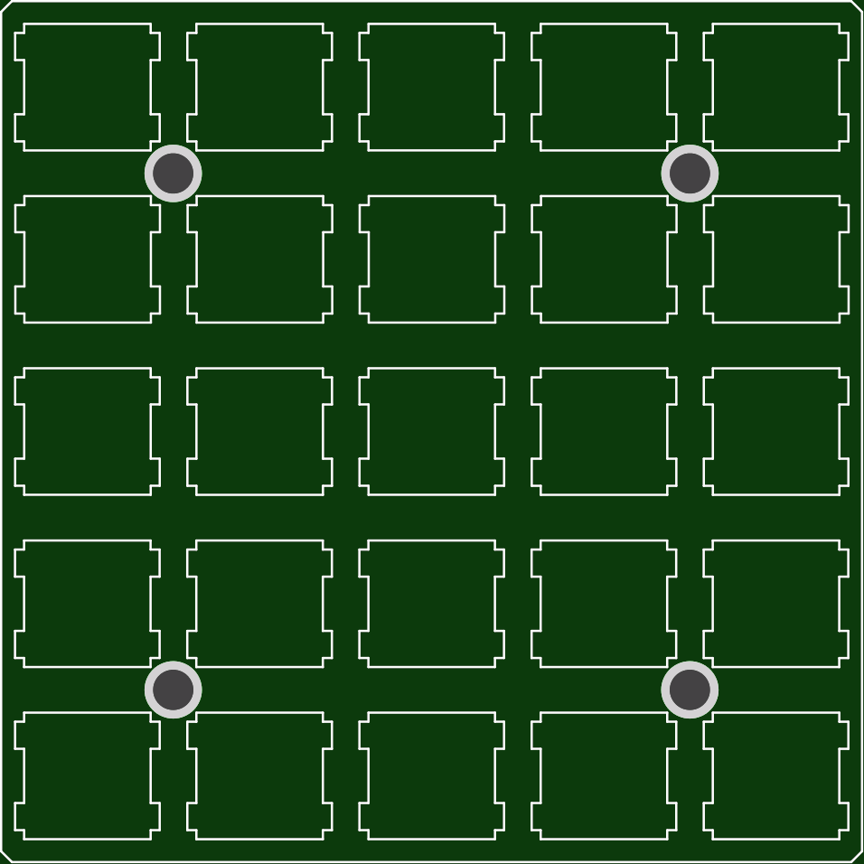

More info here:

http://www.40percent.club/2018/04/5x5.html

[How to order PCBs from gerber files](http://www.40percent.club/2017/03/ordering-pcb.html)

EasyEDA ordering info:

PCB

Gerber: 5x5.zip

    95.3mm Max* 95.3mm Max;
    Layers: 2;
    PCB Thickness: 1.6mm;
    PCB Qty.: 10;
    PCB Color: Green;
    Surface Finish: HASL;
    Copper Weight: 1;
    Panelized PCBs: 1

	
Plate

Gerber: 5x5plate.zip

    95.3mm Max* 95.3mm Max;
    Layers: 2;
    PCB Thickness: 1.6mm;
    PCB Qty.: 10;
    PCB Color: Green;
    Surface Finish: HASL;
    Copper Weight: 1;
    Panelized PCBs: 1
	
Files released under https://creativecommons.org/licenses/by-nc-sa/4.0/

