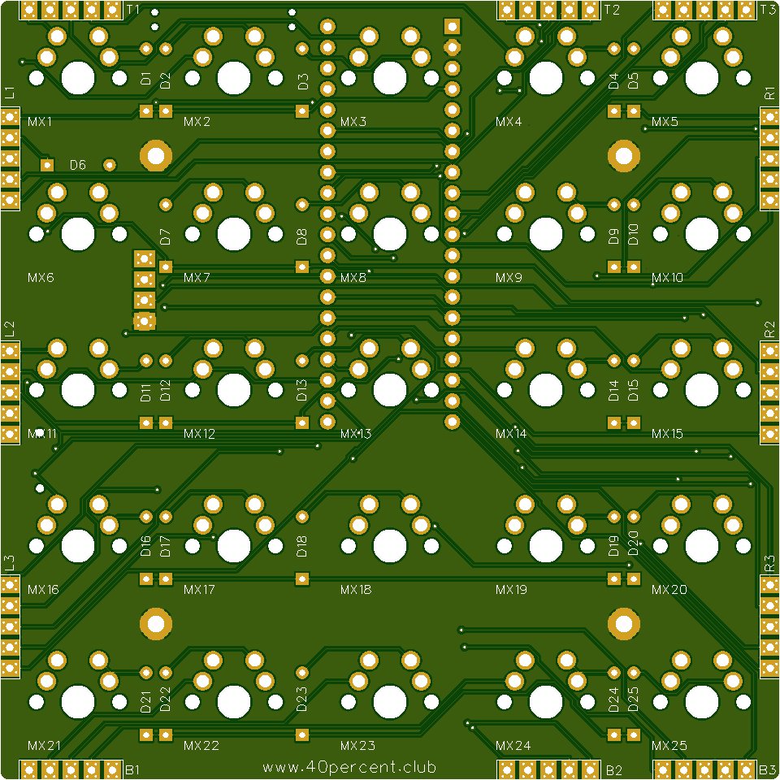

More info here:

http://www.40percent.club/2018/06/5x5x9.html

[How to order PCBs from gerber files](http://www.40percent.club/2017/03/ordering-pcb.html)

Switch parts:

4 pin header https://lcsc.com/product-detail/Male-Header_2-54-1-4PHeader-tray_C91552.html

    MFR P/N: 2.54-1*4PHeader
    LCSC Part #: C91552 
	
BOOT1 slide switch https://lcsc.com/product-detail/Toggle-Switches_9mm-3-5mm_C92658.html

    Mfr.Part #: K3-1280S-F1
	LCSC Part #: C92658 

RESET/BUT1 switch https://lcsc.com/product-detail/Tactile-Switches_ALPS_SKSCLBE010_3-3-5-1-1-Side-press-1-6N_C115361.html

    Mfr.Part #: SKSCLBE010 
	LCSC Part #: C115361 

EasyEDA ordering info:

PCB

Gerber: 5x5x9.rar

    95.3mm Max* 95.3mm Max;
    Layers: 2;
    PCB Thickness: 1.6mm;
    PCB Qty.: 10;
    PCB Color: Green;
    Surface Finish: HASL;
    Copper Weight: 1;
    Panelized PCBs: 1

	
Plate

Gerber: 5x5x9plate.rar

    95.3mm Max* 95.3mm Max;
    Layers: 2;
    PCB Thickness: 1.6mm;
    PCB Qty.: 10;
    PCB Color: Green;
    Surface Finish: HASL;
    Copper Weight: 1;
    Panelized PCBs: 1
	
Files released under https://creativecommons.org/licenses/by-nc-sa/4.0/

