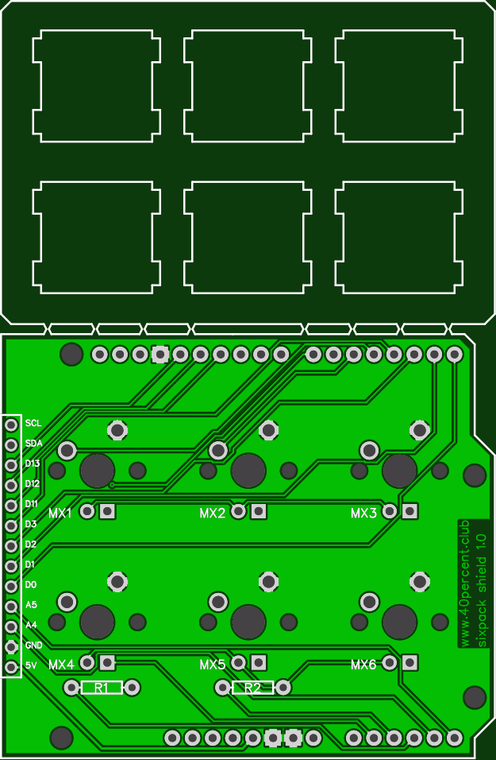

More info here:

http://www.40percent.club/2018/11/arduino-six.html

[How to order PCBs from gerber files](http://www.40percent.club/2017/03/ordering-pcb.html)

EasyEDA ordering info:

Arduino Six

Gerber: arduino_six.zip

    Layers:2 
    Dimension: 95mm*62mm 
    PCB Qty:10 
    PCB Thickness:1.6 
    PCB Color:Green 
    Surface Finish:HASL(with lead) 
    Copper Weight:1

Files released under https://creativecommons.org/licenses/by-nc-sa/4.0/

