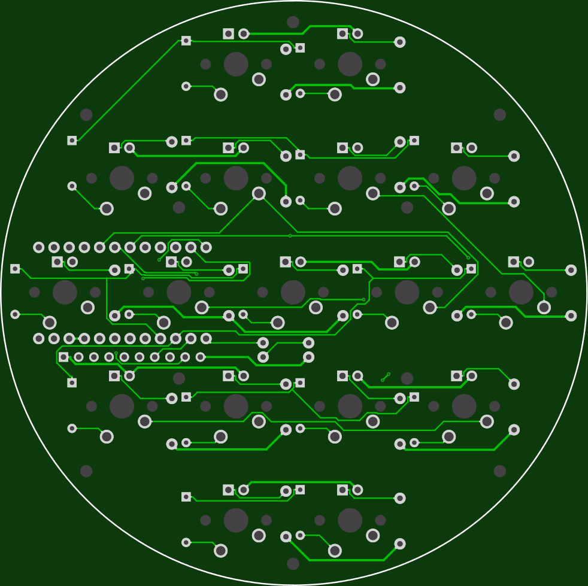
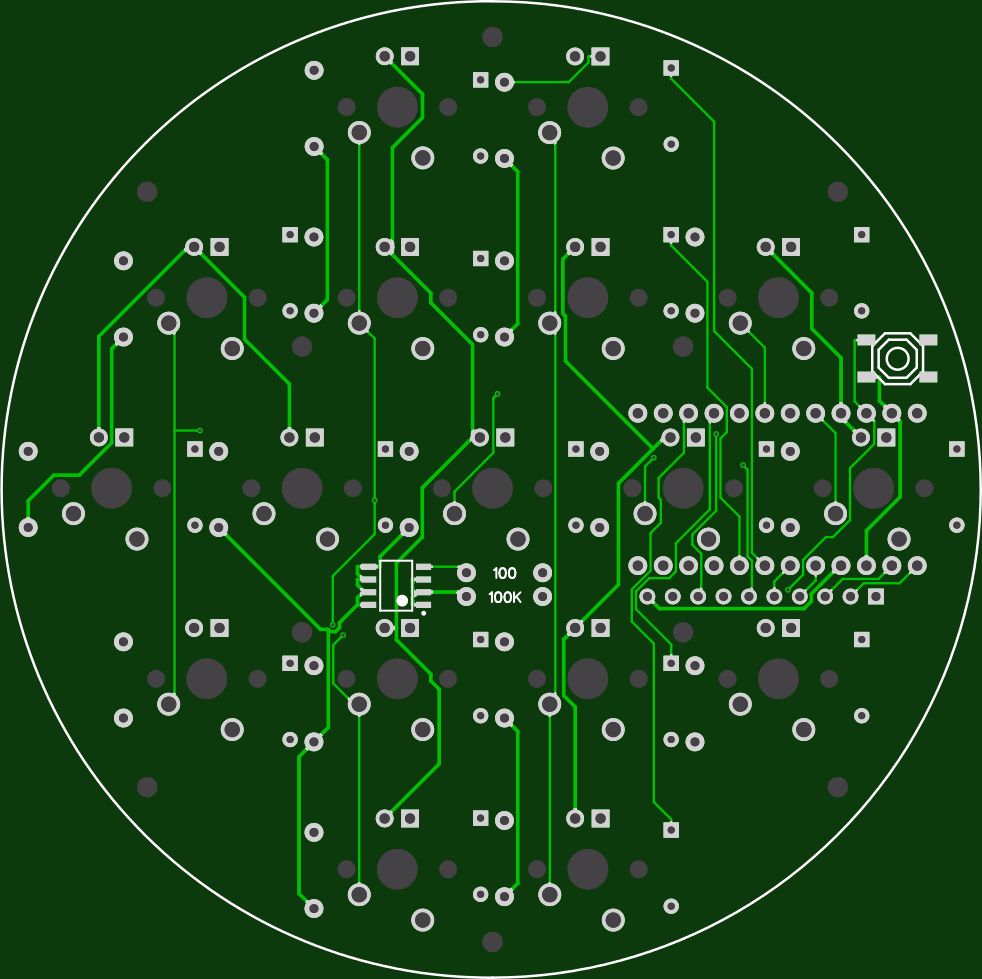

More info here:

http://www.40percent.club/2017/09/deathstar.html

[How to order PCBs from gerber files](http://www.40percent.club/2017/03/ordering-pcb.html)

EasyEDA ordering info:

PCB

Gerber: ds.zip

    97.9mm Max* 97.6mm Max;
    Layers: 2;
    PCB Thickness: 1.6mm;
    PCB Qty.: 10;
    PCB Color: Green;
    Surface Finish: HASL;
    Copper Weight: 1;
    Panelized PCBs: 1

Files released under https://creativecommons.org/licenses/by-nc-sa/4.0/

ROWS
 
    D4, C6, D7, E6, B1, B3

COLS

    F4, F5, F6

LED

    B5
