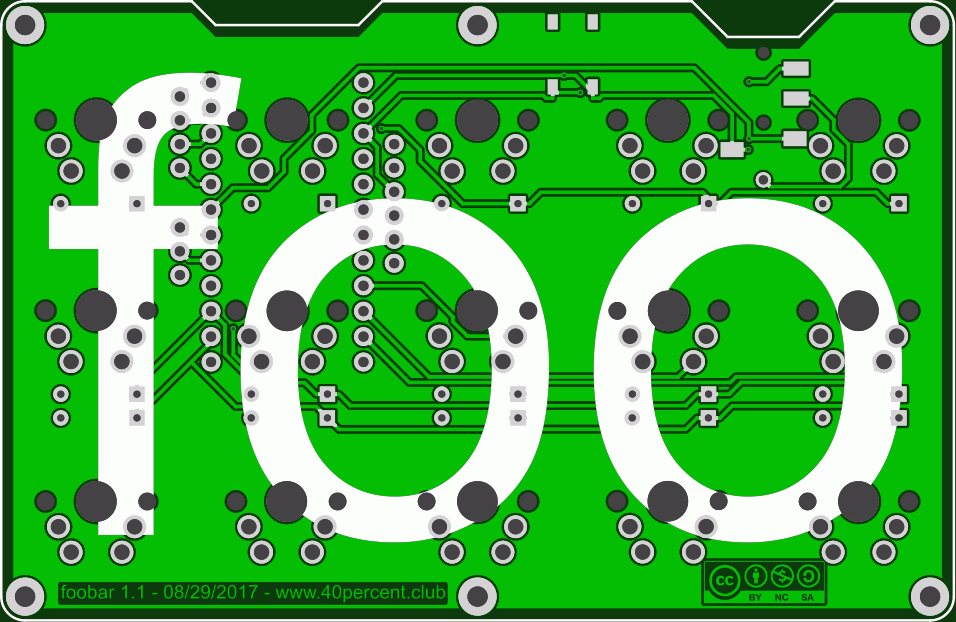
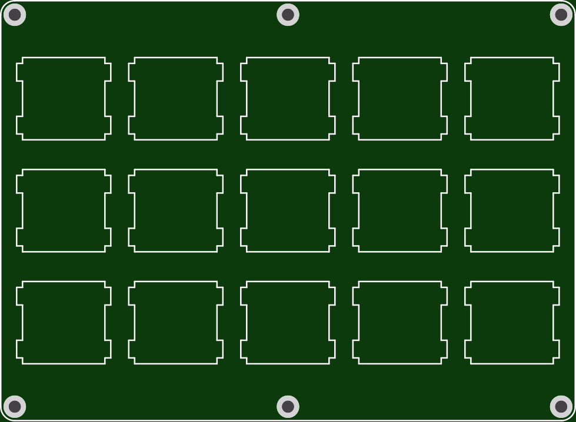

More info here:

http://www.40percent.club/2017/09/foobar-11-with-plates.html

http://www.40percent.club/2017/09/foobar-rgb-underglow.html

http://www.40percent.club/2017/09/foobar-10.html

BOM (per side)

    15 1n4148 diodes
    15 MX compatible PCB mount switches
    1 TRRS Jack Sparkfun PRT-12639
    1 Pro Micro 5v
    2 12pin headers or 1 24pin machined pin wide socket
    1 5.2mm SMT switch (RESET) https://lcsc.com/product-detail/Tactile-Switches_5-2mm-5-2mm_C92584.html

[How to order PCBs from gerber files](http://www.40percent.club/2017/03/ordering-pcb.html)

EasyEDA ordering info:

PCB

Gerber: foobar1_1.zip

    95.3mm Max* 61.9mm Max;
    Layers: 2;
    PCB Thickness: 1.6mm;
    PCB Qty.: 10;
    PCB Color: Green;
    Surface Finish: HASL;
    Copper Weight: 1;
    Panelized PCBs: 1

Gerber: foobarplate.zip

    97.6mm Max* 71.4mm Max;
    Layers: 2;
    PCB Thickness: 1.6mm;
    PCB Qty.: 10;
    PCB Color: Green;
    Surface Finish: HASL;
    Copper Weight: 1;
    Panelized PCBs: 1

	

Gerber: foobarbottom.zip

    97.6mm Max* 71.4mm Max;
    Layers: 2;
    PCB Thickness: 1.6mm;
    PCB Qty.: 10;
    PCB Color: Green;
    Surface Finish: HASL;
    Copper Weight: 1;
    Panelized PCBs: 1

Files released under https://creativecommons.org/licenses/by-nc-sa/4.0/

