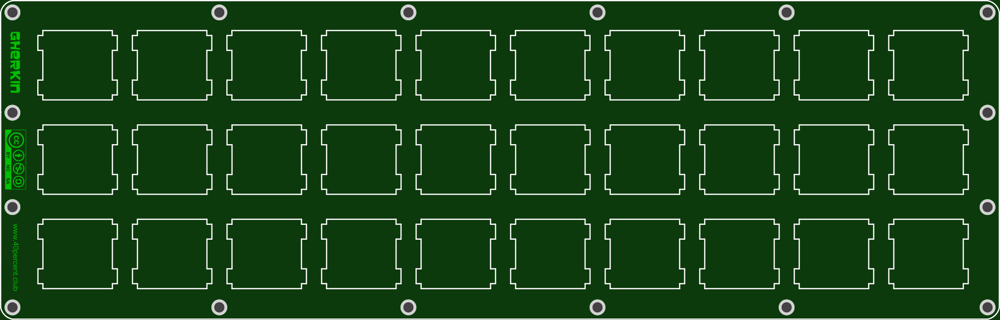
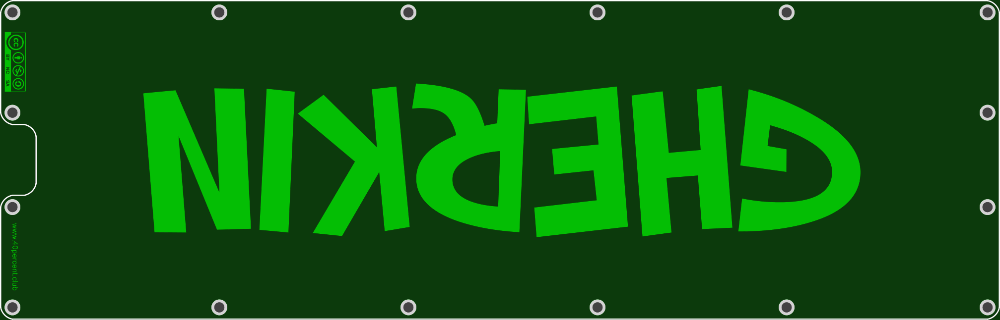

More info here:

http://www.40percent.club/2017/05/new-gherkin-plates.html

[How to order PCBs from gerber files](http://www.40percent.club/2017/03/ordering-pcb.html)

EasyEDA ordering info:

Top

Gerber: 30TopMX2.zip

    201.2mm Max* 64.3mm Max;
    Layers: 2;
    PCB Thickness: 1.6mm;
    PCB Qty.: 5;
    PCB Color: Green;
    Surface Finish: HASL;
    Copper Weight: 1;
    Panelized PCBs: 1

Bottom

Gerber: 30Bottom2.zip

    201.2mm Max* 64.3mm Max;
    Layers: 2;
    PCB Thickness: 1.6mm;
    PCB Qty.: 5;
    PCB Color: Green;
    Surface Finish: HASL;
    Copper Weight: 1;
    Panelized PCBs: 1

Gerber files released under https://creativecommons.org/licenses/by-nc-sa/4.0/

