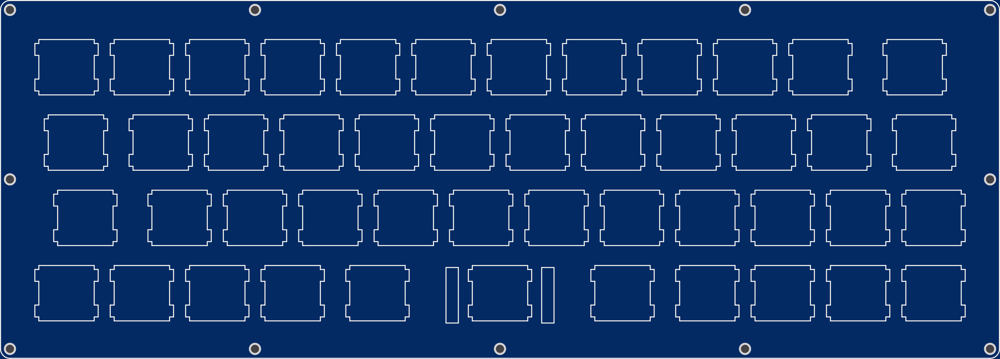

More info here:

http://www.40percent.club/2017/08/gnap-plates.html

[How to order PCBs from gerber files](http://www.40percent.club/2017/03/ordering-pcb.html)

EasyEDA ordering info:

PCB

Gerber: gnap_plate.zip

    252.4mm Max* 90.5mm Max;
    Layers: 2;
    PCB Thickness: 1.6mm;
    PCB Qty.: 5;
    PCB Color: Blue;
    Surface Finish: HASL;
    Copper Weight: 1;
    Panelized PCBs: 1

	
	

Gerber: gnap_bottom.zip

    252.4mm Max* 90.5mm Max;
    Layers: 2;
    PCB Thickness: 1.6mm;
    PCB Qty.: 5;
    PCB Color: Blue;
    Surface Finish: HASL;
    Copper Weight: 1;
    Panelized PCBs: 1

Files released under https://creativecommons.org/licenses/by-nc-sa/4.0/

