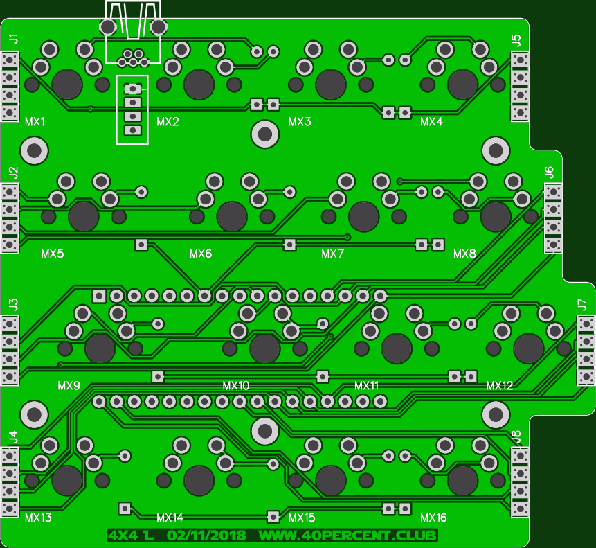
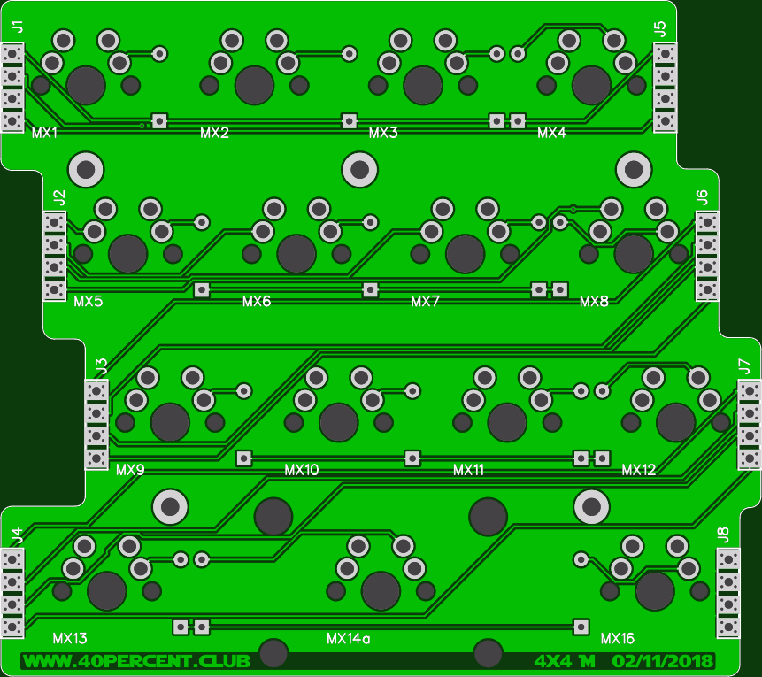
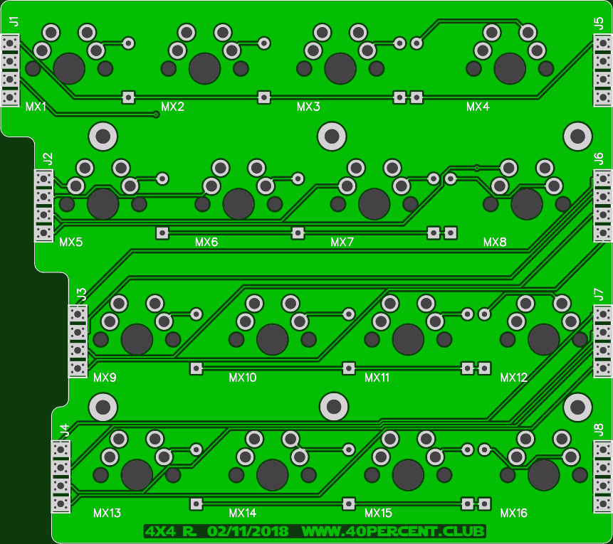

More info here:

http://www.40percent.club/2018/04/gnap-4x4.html

[How to order PCBs from gerber files](http://www.40percent.club/2017/03/ordering-pcb.html)

EasyEDA ordering info:

GNAP 4x4 Left

Gerber: GNAP4x4L.zip

    85.7mm Max* 76.2mm Max;
    Layers: 2;
    PCB Thickness: 1.6mm;
    PCB Qty.: 10;
    PCB Color: Green;
    Surface Finish: HASL;
    Copper Weight: 1;
    Panelized PCBs: 1

GNAP 4x4 Middle

Gerber: GNAP4x4M.zip

    85.7mm Max* 76.2mm Max;
    Layers: 2;
    PCB Thickness: 1.6mm;
    PCB Qty.: 10;
    PCB Color: Green;
    Surface Finish: HASL;
    Copper Weight: 1;
    Panelized PCBs: 1

GNAP 4x4 Right

Gerber: GNAP4x4R.zip

    85.7mm Max* 76.2mm Max;
    Layers: 2;
    PCB Thickness: 1.6mm;
    PCB Qty.: 10;
    PCB Color: Green;
    Surface Finish: HASL;
    Copper Weight: 1;
    Panelized PCBs: 1

Files released under https://creativecommons.org/licenses/by-nc-sa/4.0/

