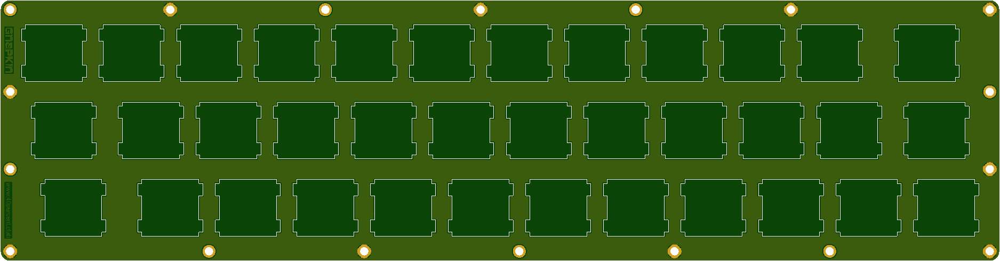
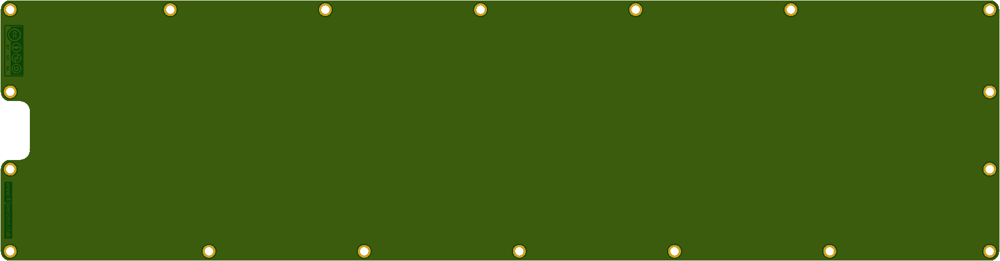

More info here:

http://www.40percent.club/2018/06/gnapkin-plates.html

[How to order PCBs from gerber files](http://www.40percent.club/2017/03/ordering-pcb.html)

EasyEDA ordering info:

Top Plate

Gerber: gnapkin_top.rar

    Layers:2 
    Dimension: 64mm*245mm 
    Thickness:1.6 PCB 
    PCB Qty.: 10;
    PCB Color: Green;
    Surface Finish: HASL;
    Copper Weight: 1;
    Panelized PCBs: 1

	
Bottom Plate

Gerber: gnapkin_bottom.rar

    Layers:2 
    Dimension: 64mm*245mm 
    Thickness:1.6 PCB 
    PCB Qty.: 10;
    PCB Color: Green;
    Surface Finish: HASL;
    Copper Weight: 1;
    Panelized PCBs: 1
	
Files released under https://creativecommons.org/licenses/by-nc-sa/4.0/

