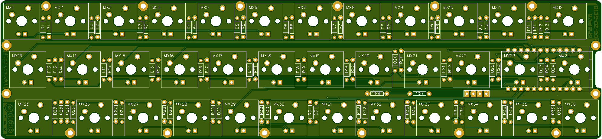

More info here:

http://www.40percent.club/2018/05/gnapkin.html

BOM (per side)

    36 1n4148 diodes
    36 MX compatible PCB mount switches
    1 Pro Micro 5v
    2 12pin headers or 1 24pin machined pin wide socket
    1 5.2mm SMT switch (RESET) https://lcsc.com/product-detail/Tactile-Switches_5-2mm-5-2mm_C92584.html

Needed if you want LEDs

    36	LEDs
    36	Resistors for LEDs. Use online LED caculator to choose value
    1	FDS6630A or DMN3018SSS-13 SOIC FET
    1	100ohm resistor
    1	100Kilo ohm resistor

[How to order PCBs from gerber files](http://www.40percent.club/2017/03/ordering-pcb.html)

EasyEDA ordering info:

Gnapkin

Gerber: gnapkin.zip

    Layers:2 
    Dimension: 55mm*238mm 
    PCB Qty:10 
    PCB Thickness:1.6 
    PCB Color:Green 
    Surface Finish:HASL(with lead) 
    Copper Weight:1

Files released under https://creativecommons.org/licenses/by-nc-sa/4.0/

