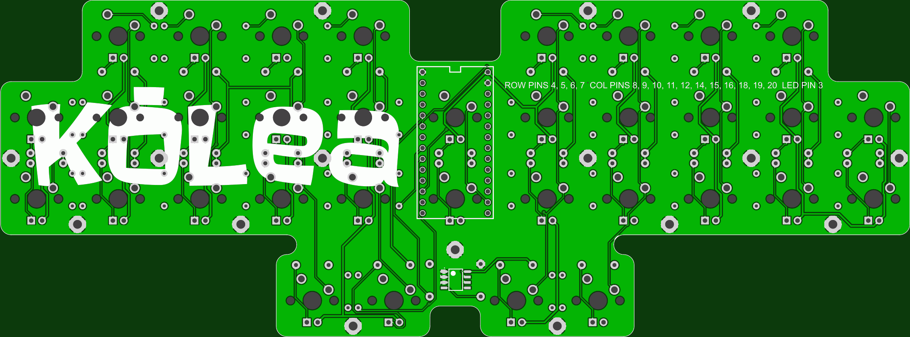

More info here:

http://www.40percent.club/2018/01/kolea.html

Firmware https://github.com/di0ib/StenoFW/blob/master/kolea.ino

[How to order PCBs from gerber files](http://www.40percent.club/2017/03/ordering-pcb.html)

BOM 

    34 1n4148 diodes
    34 MX compatible PCB mount switches
    1 Teensy LC
    2 14pin headers or 1 28pin machined pin wide socket
    
Optional for LEDs

    34	LEDs compatible with your switches (3mm flangeless, 2x3x4 rectangular or 1.8mm)
    34	Resistors for LEDs. Use online LED caculator to choose value
    1	FDS6630A or DMN3018SSS-13 SOIC FET
    1	100ohm resistor
    1	100Kilo ohm resistor

EasyEDA ordering info:

PCB

Gerber: kolea.zip

    212mm Max* 78.6mm Max;
    Layers: 2;
    PCB Thickness: 1.6mm;
    PCB Qty.: 5;
    PCB Color: Green;
    Surface Finish: HASL;
    Copper Weight: 1;
    Panelized PCBs: 1

Files released under https://creativecommons.org/licenses/by-nc-sa/4.0/

