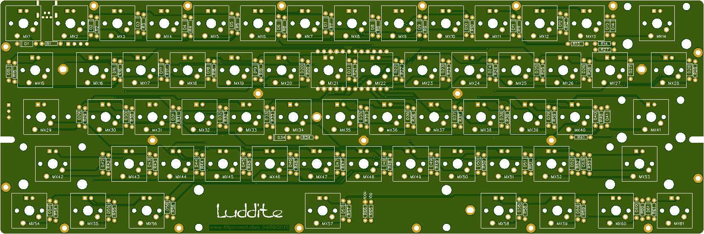
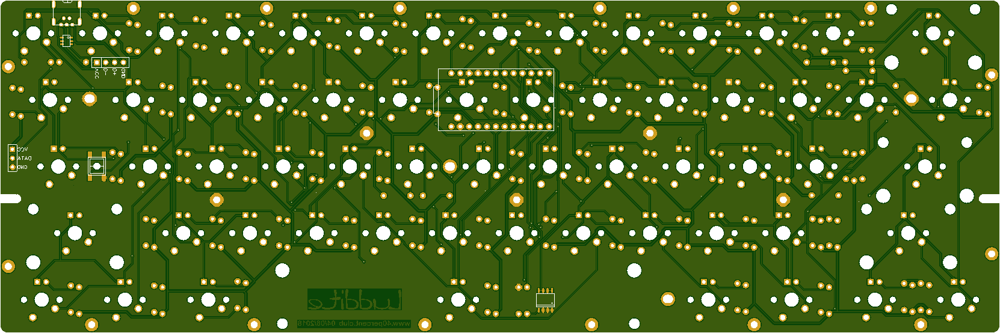

More info here:

http://www.40percent.club/2018/08/luddite-2.html

[How to order PCBs from gerber files](http://www.40percent.club/2017/03/ordering-pcb.html)

Mosfet on B5 to control backlight.

BOM

    1	Pro Micro
    2	12pin SIP headers, or 1 24 pin machined pin DIP socket
    61	1n4148 diodes, save the cut off leads for use with machined pin socket
    61	switches
    1	mini USB connector
    4	2U PCB mount stabilizers
    1	6.25U PCB mount stabilizer

Needed if you want LEDs

    61	LEDs
    61	Resistors for LEDs. Use online LED caculator to choose value
    1	FDS6630A or DMN3018SSS-13 SOIC FET
    1	100ohm resistor
    1	100Kilo ohm resistor
    
Optional

    1	5.2x5.2mm tactile Reset switch
    1	USBLC6-4SC6 ESD protection
    8	WS2812B RGB LEDs

EasyEDA ordering info:

PCB

Gerber: luddite2.rar

    Layers:2 
    Dimension: 95mm*286mm 
    Thickness:1.6 PCB 
    PCB Qty.: 10;
    PCB Color: Green;
    Surface Finish: HASL;
    Copper Weight: 1;
    Panelized PCBs: 1

	
Files released under https://creativecommons.org/licenses/by-nc-sa/4.0/

