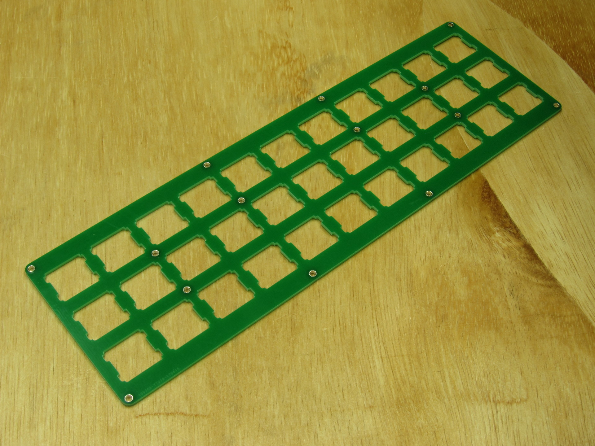
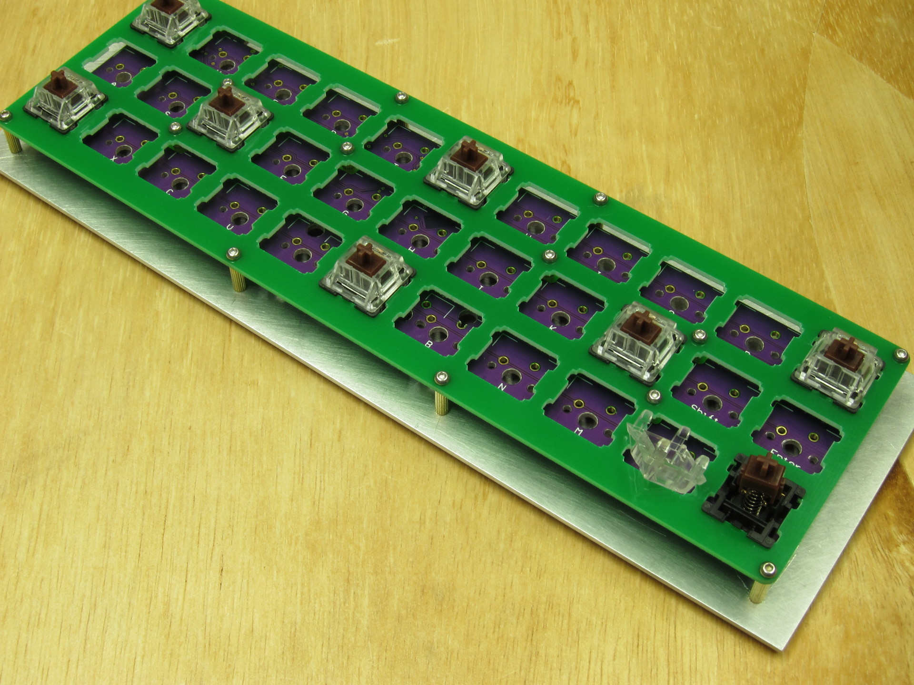
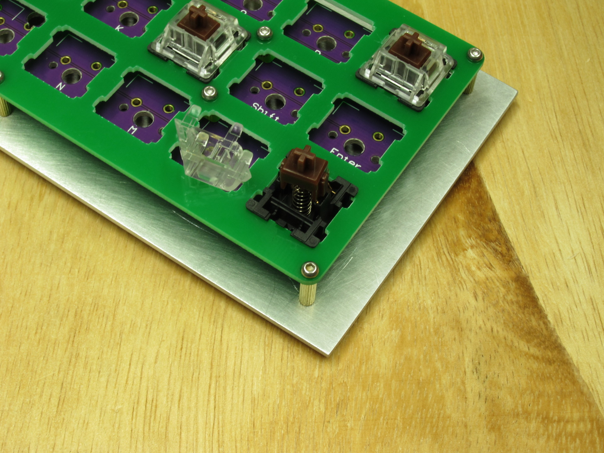

Gerber: miuni.zip

    214.3mm Max* 66.7mm Max;
    Layers: 2;
    PCB Thickness: 1.6mm;
    PCB Qty.: 5;
    PCB Color: Green;
    Surface Finish: HASL;
    Copper Weight: 1;
    Panelized PCBs: 1

Gerber files released under https://creativecommons.org/licenses/by-nc-sa/4.0/

