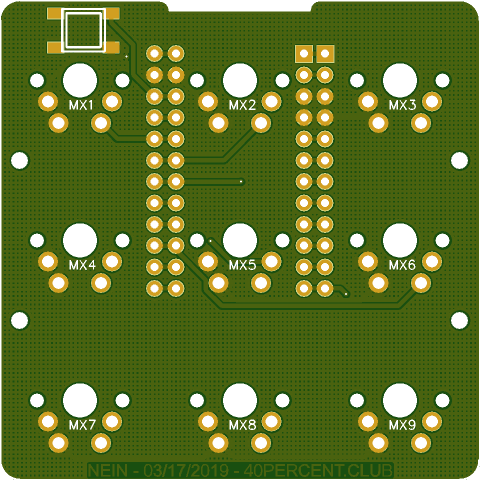
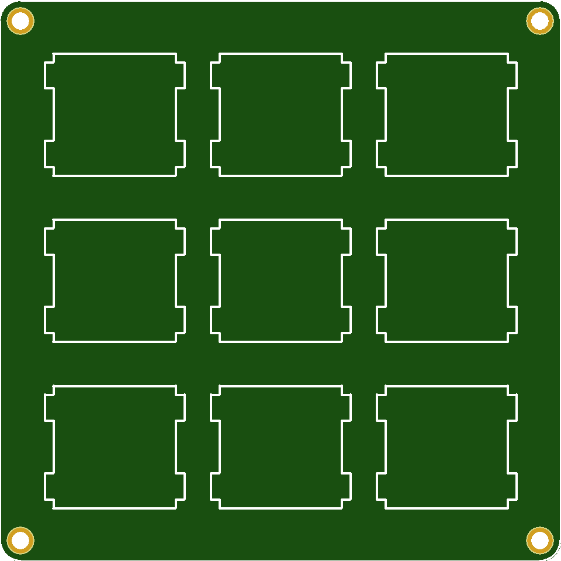
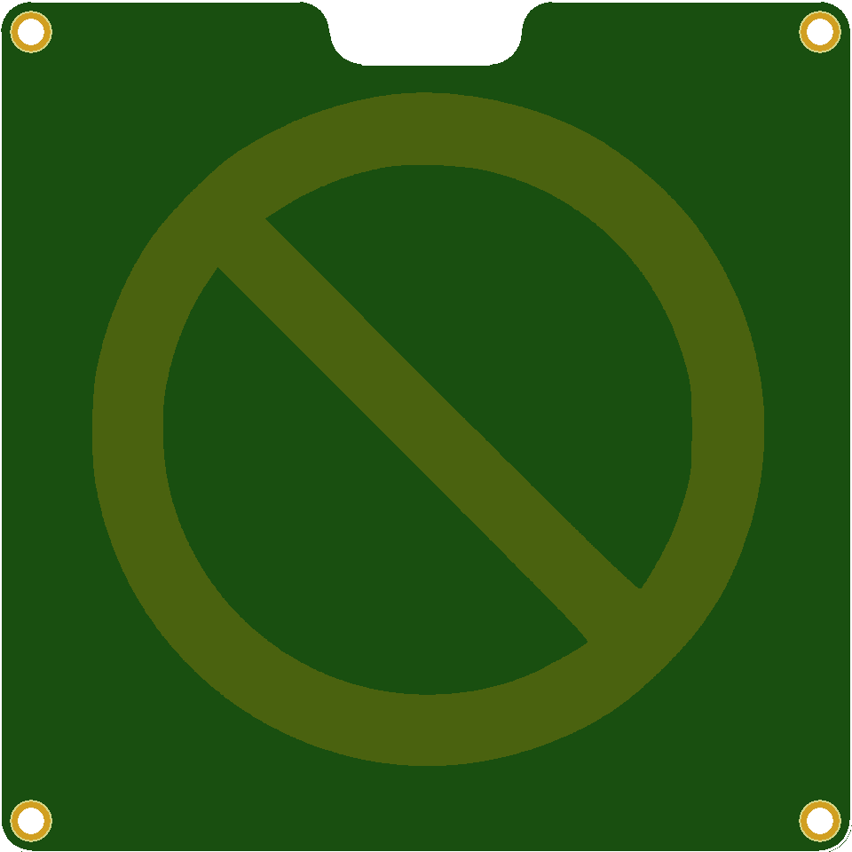

More info here:

http://www.40percent.club/2019/04/nein.html

[How to order PCBs from gerber files](http://www.40percent.club/2017/03/ordering-pcb.html)

EasyEDA ordering info:

PCB

Gerber: nein.zip

    Layers:2
    Dimension:57mm*57mm
    PCB Thickness:1.6
	
Top

Gerber: nein_top.zip

    Layers:2
    Dimension:64mm*64mm
    PCB Thickness:1.6
	
Top

Gerber: nein_bottom.zip

    Layers:2
    Dimension:64mm*64mm
    PCB Thickness:1.6
	
Files released under https://creativecommons.org/licenses/by-nc-sa/4.0/

