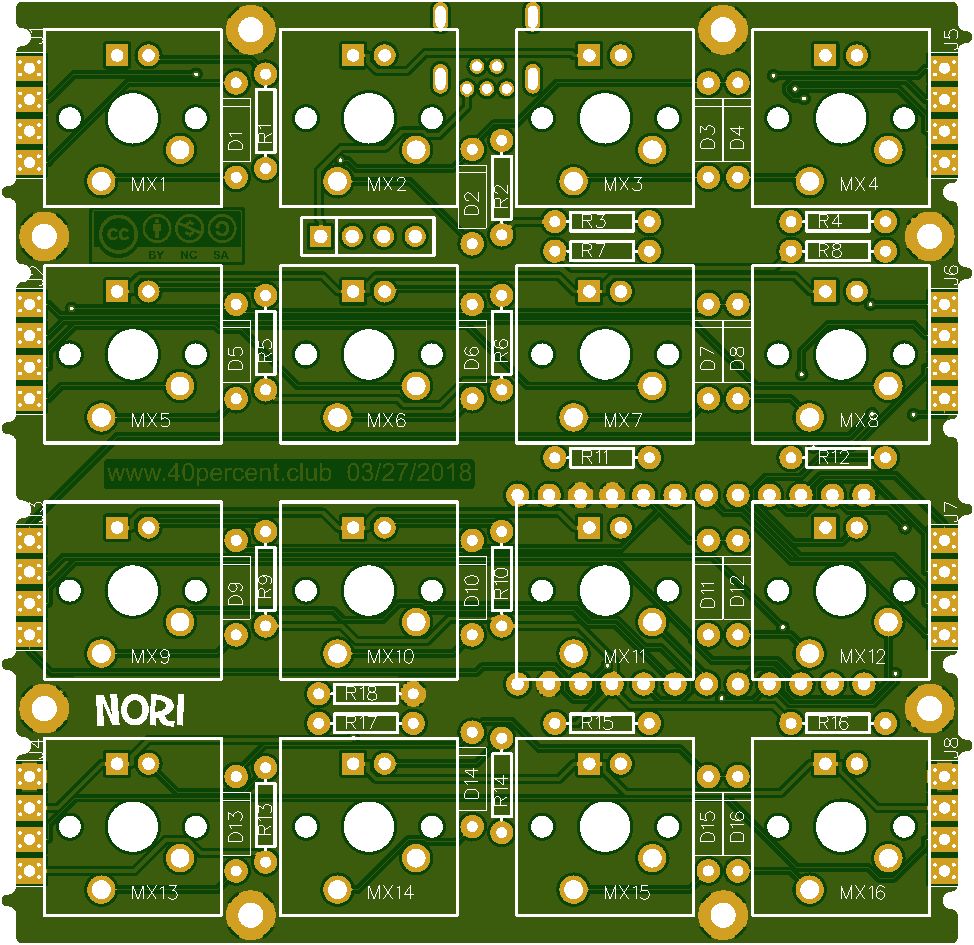
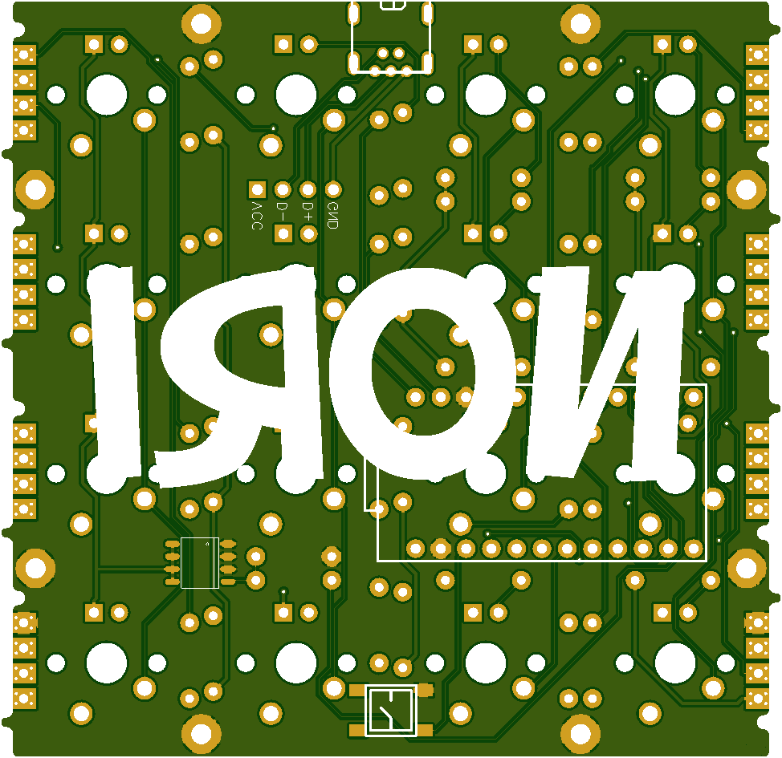
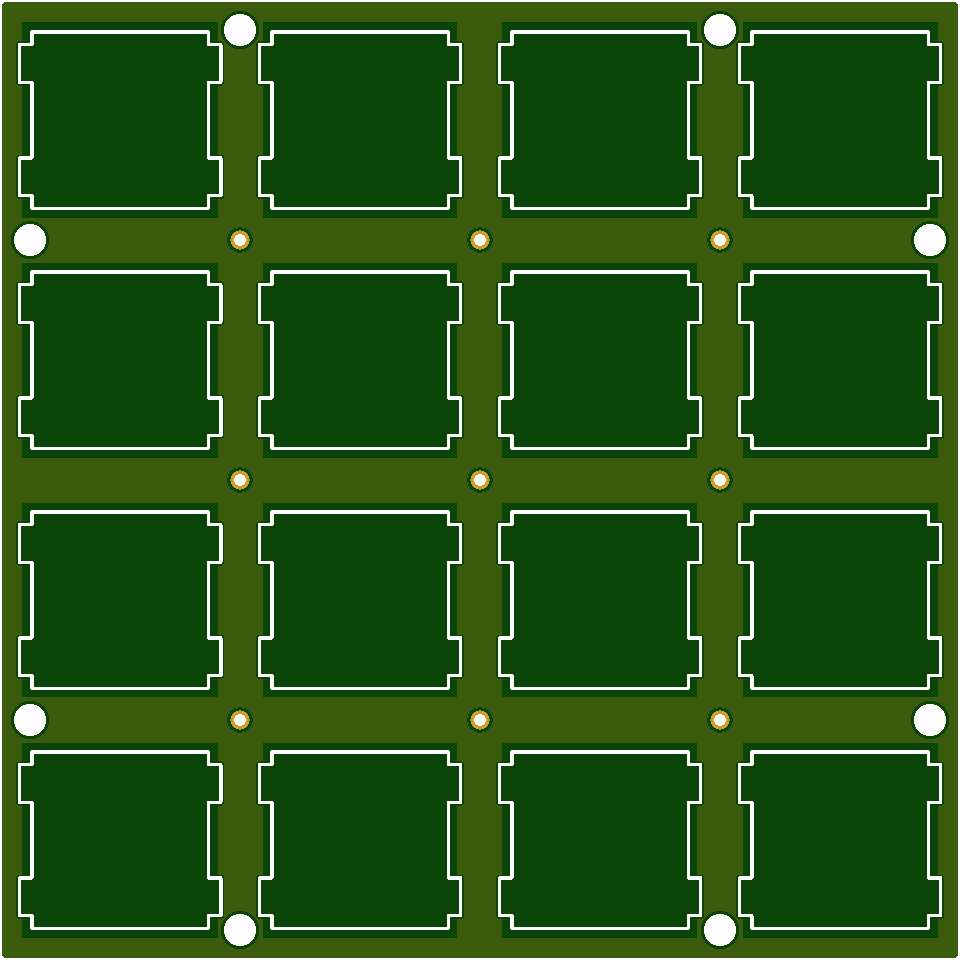
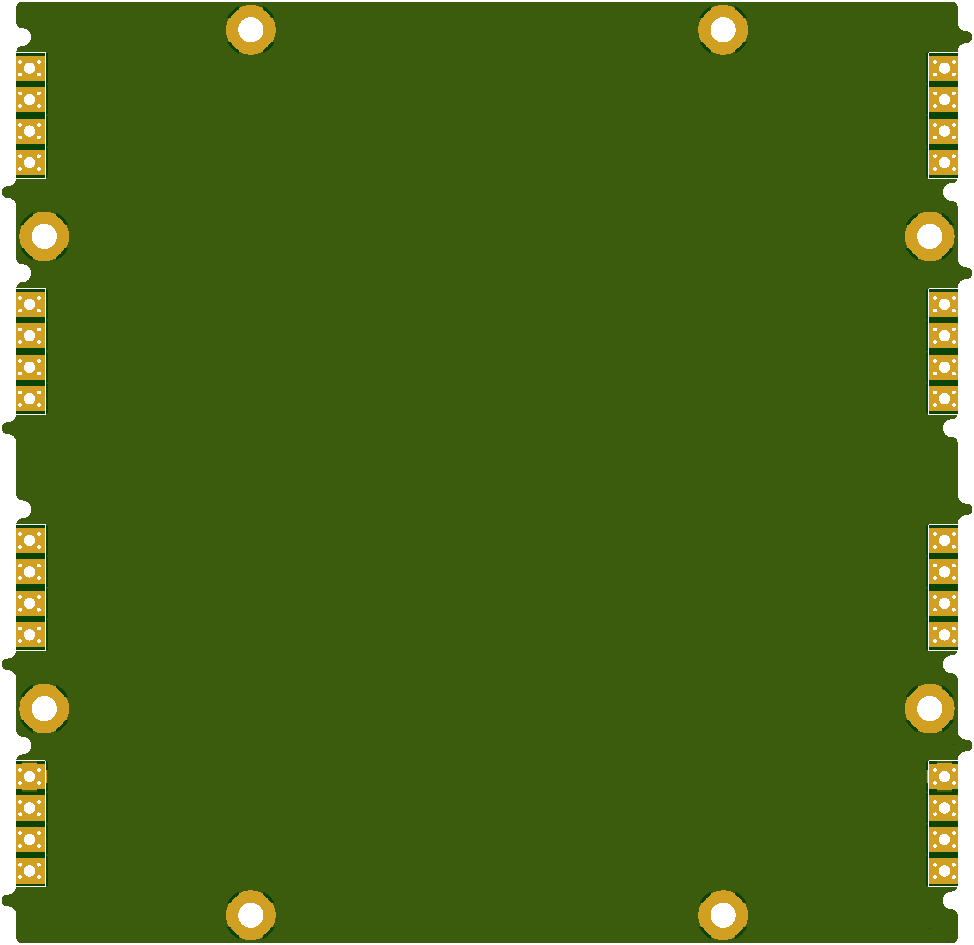

More info here:

http://www.40percent.club/2018/10/nori.html

[How to order PCBs from gerber files](http://www.40percent.club/2017/03/ordering-pcb.html)

EasyEDA ordering info:

BOM

    1	Pro Micro
    2	12pin SIP headers, or 1 24 pin machined pin DIP socket
    48	1n4148 diodes, save the cut off leads for use with machined pin socket
    48	switches
    1	mini USB connector

Needed if you want LEDs

    48	LEDs
    48	Resistors for LEDs. Use online LED caculator to choose value
    1	FDS6630A or DMN3018SSS-13 SOIC FET
    1	100ohm resistor
    1	100Kilo ohm resistor
    
Optional

    1	5.2x5.2mm tactile Reset switch

nori

Gerber: nori-pcb.rar

    Layers:2 
    Dimension: 76mm*79mm 
    PCB Qty:10 
    PCB Thickness:1.6 
    PCB Color:Green 
    Surface Finish:HASL(with lead) 
    Copper Weight:1

	
nori plate top

Gerber: nori-plate-top.rar

    Layers:2 
    Dimension: 76mm*76mm 
    PCB Qty:10 
    PCB Thickness:1.6 
    PCB Color:Green 
    Surface Finish:HASL(with lead) 
    Copper Weight:1
	

nori plate bottom

Gerber: nori-plate-bottom.rar

    Layers:2 
    Dimension: 76mm*79mm 
    PCB Qty:10 
    PCB Thickness:1.6 
    PCB Color:Green 
    Surface Finish:HASL(with lead) 
    Copper Weight:1

Files released under https://creativecommons.org/licenses/by-nc-sa/4.0/

