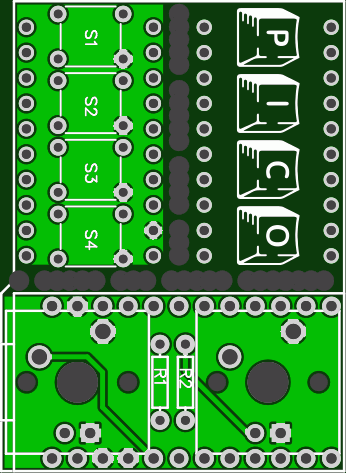

More info here:

http://www.40percent.club/2016/12/pico.html

http://www.40percent.club/2016/12/two-keys.html

[How to order PCBs from gerber files](http://www.40percent.club/2017/03/ordering-pcb.html)

EasyEDA ordering info:

    34.3mm Max* 47mm Max;
    Layers: 2;
    PCB Thickness: 1.2mm;
    PCB Qty.: 30;
    PCB Color: Green;
    Surface Finish: HASL;
    Copper Weight: 1;
    Panelized PCBs: 1

Files released under https://creativecommons.org/licenses/by-sa/4.0/

### An example of how to comply with an open source license:

https://www.reddit.com/r/mechmarket/comments/6aryaz/uscah_gherkin_w_black_pcb_kits_and_custom/

https://github.com/Emmryu/Gherkin
