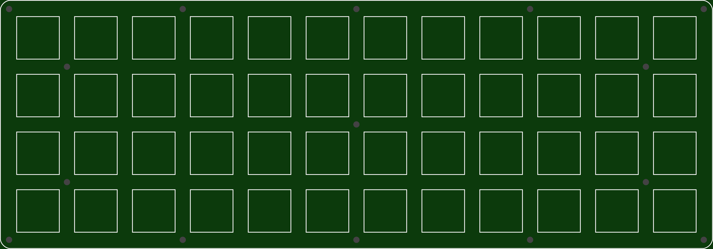
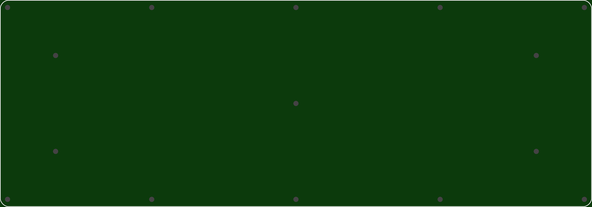

Using these plates with a Planck PCB requires grinding notches into the PCB for the standoffs to fit. See http://www.40percent.club/2017/02/pcb-plate-planck.html

[How to order PCBs from gerber files](http://www.40percent.club/2017/03/ordering-pcb.html)

EasyEDA ordering info:

Top/Bottom same size

    233.7mm Max* 81.7mm Max;
    Layers: 2;
    PCB Thickness: 1.6mm;
    PCB Qty.: 5;
    PCB Color: Green;
    Surface Finish: HASL;
    Copper Weight: 1;
    Panelized PCBs: 1

Gerber files released under https://creativecommons.org/licenses/by-sa/4.0/

