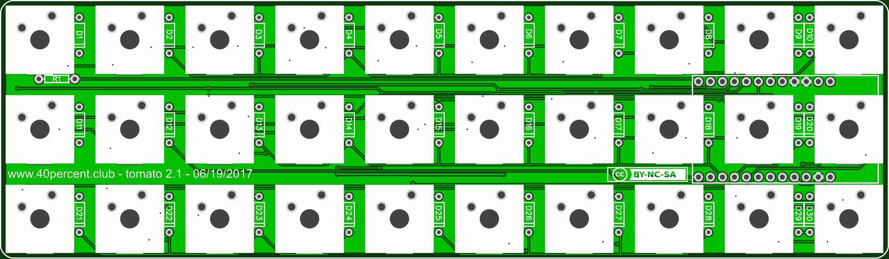

More info here:

http://www.40percent.club/2017/05/30-rgb.html

http://www.40percent.club/2017/06/tomato-13-30-rgb.html

http://www.40percent.club/2017/07/tomato-in-gherkin.html

[How to order PCBs from gerber files](http://www.40percent.club/2017/03/ordering-pcb.html)

EasyEDA ordering info:

PCB

Gerber: Tomato.zip

    188.1mm Max* 54.8mm Max;
    Layers: 2;
    PCB Thickness: 1.2mm;
    PCB Qty.: 5;
    PCB Color: Green;
    Surface Finish: HASL;
    Copper Weight: 1;
    Panelized PCBs: 1

Files released under https://creativecommons.org/licenses/by-nc-sa/4.0/

