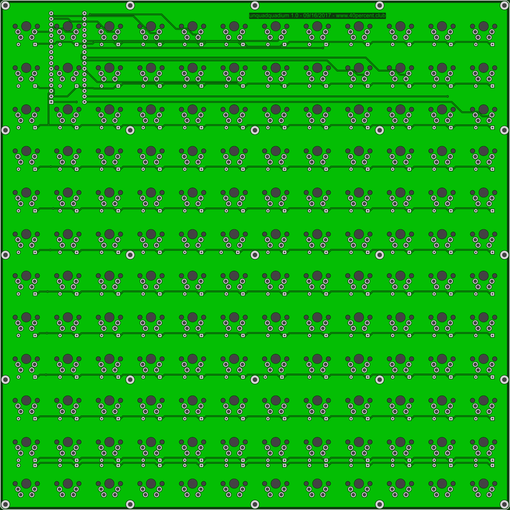
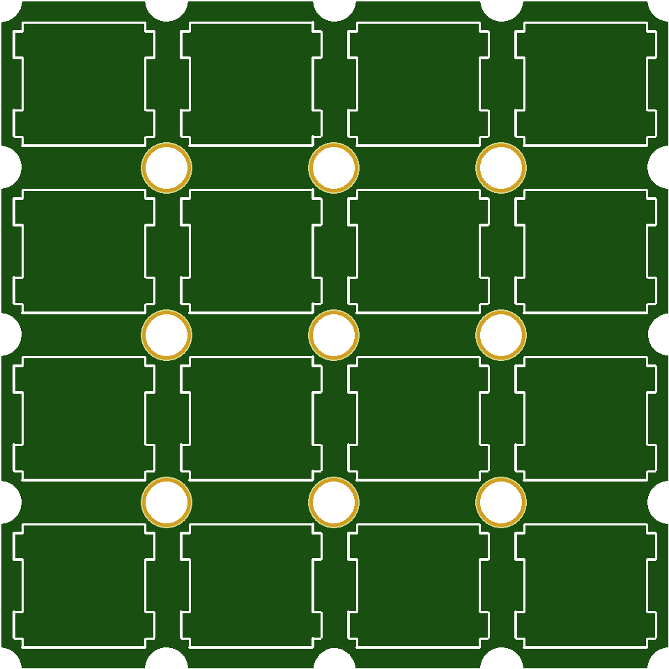

More info here:

http://www.40percent.club/2017/10/unquadquad.html

BOM

    144 1n4148 diodes
    144 MX compatible PCB mount switches
    1 Arduino Micro (not Pro Micro)
    2 17pin headers or 1 40pin machined pin wide socket

[How to order PCBs from gerber files](http://www.40percent.club/2017/03/ordering-pcb.html)

EasyEDA ordering info:

PCB

Gerber: unquadquad.zip

    233.4mm Max* 233.4mm Max;
    Layers: 2;
    PCB Thickness: 1.6mm;
    PCB Qty.: 5;
    PCB Color: Green;
    Surface Finish: HASL;
    Copper Weight: 1;
    Panelized PCBs: 1

Mini Top Plate

Gerber: 12x12minitop.zip

    76mm Max* 76mm Max;
    Layers: 2;
    PCB Thickness: 1.6mm;
    PCB Qty.: 5;
    PCB Color: Green;
    Surface Finish: HASL;
    Copper Weight: 1;
    Panelized PCBs: 1

Files released under https://creativecommons.org/licenses/by-nc-sa/4.0/

